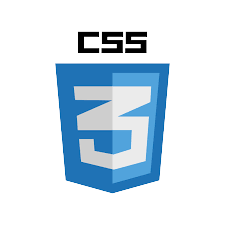
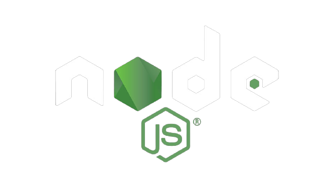

<!DOCTYPE html>
<html lang="en">

<head>
    <meta name="viewport" content="width=device-width, initial-scale=1">
    <title>Apurva Singh</title>
    <link rel="icon" href="AS logo.png" type="image/icon type">
    <!--For animations in CSS-->
    <link rel="stylesheet" href="https://cdnjs.cloudflare.com/ajax/libs/animate.css/4.1.1/animate.min.css" />
    <!--This is for the font-->
    <link rel="preconnect" href="https://fonts.gstatic.com">
    <link href="https://fonts.googleapis.com/css2?family=Zen+Dots&display=swap" rel="stylesheet">
    <!--This is for Bootstrap Dependencies-->
    <link href="https://cdnjs.cloudflare.com/ajax/libs/font-awesome/5.15.1/css/all.min.css" rel="stylesheet" />
    <link href="https://cdn.jsdelivr.net/npm/bootstrap@5.0.0-beta3/dist/css/bootstrap.min.css" rel="stylesheet" integrity="sha384-eOJMYsd53ii+scO/bJGFsiCZc+5NDVN2yr8+0RDqr0Ql0h+rP48ckxlpbzKgwra6" crossorigin="anonymous">
    <link type="text/css" rel="stylesheet" href="style.css" />
</head>

<body id="bdy">
    <!--Navbar-->
    

        <nav class="navbar navbar-expand-lg navbar-dark bg-dark fixed-top" id="my-nav">
            
            <a class="navbar-brand" id="n_brand" href="#main_page">Apurva Singh</a>
            <button class="navbar-toggler" data-target="#my-nav" data-toggle="collapse" aria-controls="my-nav" aria-expanded="false" aria-label="Toggle navigation">
            
        </button>
            

                <ul class="navbar-nav mr-auto">
                    <li class="nav-item">
                        <a class="nav-link" href="#about_us">About Us</a>
                    </li>
                    <li class="nav-item">
                        <a class="nav-link" href="#experience">Experience</a>
                    </li>
                    <li class="nav-item">
                        <a class="nav-link" href="#education">Eduction</a>
                    </li>
                </ul>
            

        </nav>
    

    

        <!--Main Page-->
        

            

                

                    

                        
                        <h1 class="display-1">Hello! I am Apurv Singh</h1>
                        <h5 id="desc">And I am a Django web developer</h5>
                    

                

            

        

    

    <!--About us Section-->
    

        

            

                <h1 id="about_heading">About Me</h1>
            

            

                Creating web applications gives me the utmost joy, it gives me a sense of achievement. The ability to code, which innovates the user interface to optimum gives me satisfaction, I believe that I am a perfectionist and this can be seen in my code. I love
                programming because it is infinite and constantly changing. It has more potential for innovation, experimentation and discovery.   I am compelled to create smoother softwares as nobody, including me, likes slow and
                outdated technology. I hope that the improvements I make can improve the world.    My approach is simple: l think to make something great, one should think about how they would like it to be? Personal touch is important. Because
                isn’t homemade always better than fast fare? Join me, and let’s build a better modern web!
            

        

    

    

        <!--Experience Setion-->
        

            <h1 id="work_title">Work Experience</h1>
        

        

            

                

                    

                        
                    

                    

                        <h4 class="card-title" style="margin-top: 35px;">Web Development Intern</h4>
                        Company NameAnafins  Internship Dates EmployedApr 2019 – Aug 2019  Employment Duration 5 months  Location New Delhi, Delhi, India  Helped with the maintenance and bugs on their website:
                         <a href="https://www.anafins.com/">https://www.anafins.com</a>
                    

                

            

            

                

                    

                        
                    

                    

                        <h4 class="card-text" style="margin-top: 35px;">Web Development Freelance</h4>
                        Company Name Vir Shahid Om Fuel Center  Dates Employed Apr 2020 – Jun 2020  Employment Duration 3 months  LocationBhagalpur, Bihar, India  Made their website in wordpress: <a href="http://www.omfuel.in/">http://www.omfuel.in</a> 
                    

                

            

            

                

                    

                        
                    

                    

                        <h4 class="card-text" style="margin-top: 35px;">Web Development Freelance</h4>
                        Company Name Awesome Breuty Parlour  Dates Employed Jun 2020 – Aug 2020  Employment Duration 3 months  Location Gurgaon,Haryana   Made their website in wordpress: <a href="http://www.awesomebeauty.in/">http://www.awesomebeauty.in</a> 
                    

                

            

        

    

    <!--Education Section-->
    

        <h1>Educationnal Background</h1>
        

            <ul>
                <li>B.Tech From Guru Gobindh Singh Indraprastha University</li>
                <li>CS50's Web programming With Python and Javascript by HARVARDX</li>
                <li>Android App Development By Ducat.inc</li>
            </ul>
        

    

    

        
        
        
    

    <!--Technical speciality-->
    

        <h1 id="tech_title">Technologies I am Fluent In!!</h1>
        

            
            
            
            
            
            
            
            
            
        

    

    <!--Contact us page-->
    

        <footer>
            <h1>Location :-</h1>
            New Delhi, Delhi   India,110038
        </footer>
        <footer>
            <h1>Around the web</h1>
            <a class="btn" href="https://github.com/ApsMJ23" role="button"><i class="fab fa-github" style="font-size: 40px;"></i></a>
            <a class="btn" href="mailto:apurvalion@gmail.com" role="button"><i class="fab fa-google" style="font-size: 40px;"></i></a>
            <a class="btn" href="https://www.linkedin.com/in/apurva-singh-358151159/" role="button"><i class="fab fa-linkedin" style="font-size: 40px;"></i></a>
            <a class="btn" href="https://www.instagram.com/apurvawithan_a/" role="button"><i class="fab fa-instagram" style="font-size: 40px;"></i></a>

        </footer>
        <footer style="text-align: right;">
            Made By Apurva Singh &#169;
        </footer>

    

</body>

</html>